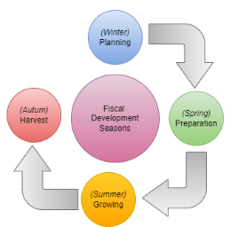
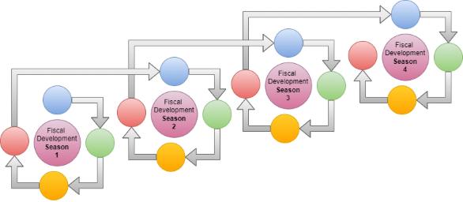

# Futures, Resource Efficiency and Scheduling (FRESh) Framework

***By: [IT Almanac Insights](index.md) - "Harvesting the Power of Information Technology"***

## Introduction to the FRESh Framework

**"Data delivered on time and on budget."**

In today’s rapidly evolving technological landscape, larger enterprises and public sector organizations are often expected by their clients and the public to be cautious, if not outright laggards, when it comes to adopting new technologies. These organizations face immense pressure to balance innovation with stability, ensuring that any new implementation aligns with strict compliance, security, and reliability standards.

The **Futures, Resource Efficiency and Scheduling (FRESh) Framework** responds to this challenge by prioritizing predictable outcomes over risky experimentation. It focuses on delivering results within established timelines and budgets, helping organizations navigate the delicate balance between innovation and reliability. By emphasizing stability and minimizing unplanned disruptions, FRESh ensures projects maintain a steady pace of progress, making it particularly valuable in environments where the stakes of failure are high.

At the heart of this framework, the crop to be harvested is analogous to client data. Just as a farmer prioritizes a successful harvest over the specific tools used, in IT, the data itself is the focus. The tools employed to cultivate the data are less important than ensuring its timely and efficient delivery. Like farm equipment that becomes obsolete, IT tools quickly lose relevance and can turn into technical debt. The goal is not the tools, but the crop — _the data_. By keeping the focus on delivering data on time and on budget, FRESh helps organizations avoid the pitfalls of over-focusing on technology and instead keeps attention on what truly matters: _the successful harvest and effective use of information_.

---

### Practice: The Growing Season Cycle

Just as a farmer plans and executes a full growing season—from preparing the soil in spring, planting and tending crops through summer, to harvesting in the fall—our one-year project follows a similar cycle. Each fiscal year is like a growing season: it starts with careful planning, involves diligent execution and management, and ends with a harvest where we assess our yields and prepare for the next season. This annual rhythm ensures we stay focused, productive, and ready for whatever the next cycle brings.

### Practice: Four-Year Tractor Cycle

Just like a farmer who replaces a tractor every four years to ensure the machinery stays efficient and up-to-date, we plan for a four-year lifecycle for our tools and systems. This approach anticipates wear and tear and keeps us prepared for upgrades, ensuring that our equipment—or in our case, technology—doesn't become outdated or inefficient, maintaining peak performance on the farm.

### Practice: Plan for the Unexpected ('Futures')

In the FRESh framework, just as farmers hedge against uncertain crop yields by investing in futures, IT teams should always have a "Plan B" or exit strategy ready if projects risk missing budget or timelines. This exit strategy can be implemented at any point during the four-year cycle but **must** be applied at the end of the fourth cycle. This ensures that by the end of each four-year period, teams either course-correct or move on to a new approach, avoiding the pitfalls of persisting with failing strategies. This practice emphasizes the importance of adaptability and forward planning to maintain organizational success.

### Practice: Four-Year Review Cycle (Olympiad)

Just like an "Olympiad" for the farm, every four years, farm managers, crop scouts, and small tractor crews are assessed based on their performance over the last four growing seasons. This review focuses on identifying which teams consistently delivered their crops on time and within budget. To foster a spirit of healthy competition and drive continuous improvement, the results are published, and a "medal count" is awarded to the top-performing teams. Those who excel are publicly recognized for their achievements, with scores displayed in a visible place for all to see, creating a culture where excellence is celebrated, and everyone strives to improve their standing in the next cycle. This transparent approach not only highlights the best practices but also motivates all teams to refine their strategies and work more efficiently in pursuit of excellence.

### Practice:  The Small Tractor Crews

Just like a small, nimble tractor crew that can efficiently manage a field without getting in each other’s way, our team is kept small and focused. With just the right number of hands to work the land effectively, we avoid the bottlenecks and miscommunications that can happen in larger groups. A small crew ensures that everyone knows their role, communicates quickly, and adapts easily to changes in the field conditions.

### Practice: Annual Interaction with Managers and Clients

Just as a farm manager only gathers the field hands and meets with buyers at the year-end harvest festival, we limit interactions between managers, employees, and clients to a single annual review. This practice allows for a comprehensive summary of the year’s work, celebrates successes, and sets expectations for the next season, while minimizing disruptions throughout the year and allowing the team to focus on their tasks independently.

### Practice: Work Silently, Grow Efficiently

Just as farmers don’t spend their days talking about the tools they use in the fields, those who follow the FRESh framework focus on their work rather than discussing the framework itself. The emphasis is on cultivating results, not conversations. The framework is a means to an end, quietly guiding the team’s efforts without becoming the center of attention. By keeping discussions focused on the task at hand, teams can work more efficiently and let their outcomes speak for themselves.

### Practice: Flexibility Over Dogmatism

Just as a farmer knows when to adapt to changing weather rather than sticking rigidly to the plan, teams using the FRESh framework should recognize when adherence to a practice becomes counterproductive. If you or your team become too dogmatic about any of the practices in the framework, it's essential to step back and refocus on the primary goal: delivering on time and within budget. The practices are tools to achieve this goal, not rules to be followed at the expense of success.

### Practice: The Crop Comes First, Not Innovation

Innovation is like experimenting with new farming techniques during the growing season—it's great if it helps the harvest. But if your new methods risk delaying the harvest or exceeding the budget, it's time to put them aside. Focus on delivering the crop on time and within budget. Innovation is a bonus, not the goal. The priority is a successful and timely harvest.

### Practice:  Glass Silos

Teams or "Tractor Crews" operate within "Glass Silos" — transparent structures that allow each team to observe the activities and progress of other teams without direct interaction until the year-end harvest festival. Each team can focus on their specific responsibilities while maintaining awareness of the broader picture.

---
 
<a property="dct:title" rel="cc:attributionURL" href="https://it-almanac-insights.github.io"> Futures Resource Efficiency and Scheduling (FRESh) Framework </a> by <a rel="cc:attributionURL dct:creator" property="cc:attributionName" href="https://it-almanac-insights.github.io">IT Almanac Insights</a> is licensed under <a href="https://creativecommons.org/licenses/by-sa/4.0/?ref=chooser-v1" target="_blank" rel="license noopener noreferrer" style="display:inline-block;">CC BY-SA 4.0</a>
 
