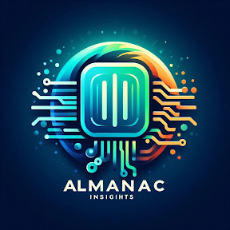

# IT Almanac Insights
***"Harvesting the Power of Information Technology"***

- [Green Thumb Information Technology Manifesto](green-thumb-mainfesto.md)
- [Futures Resource Efficiency and Scheduling (FRESh) Framework](fresh-framework.md)
- [Nimble the Watergile](nimble-the-watergile.md)

## About IT Almanac Insights

At Almanac Insights, we’re not here to dazzle with flashy innovations or groundbreaking philosophies. We’re a team of seasoned professionals, each with over 20 years of experience working within the steady, often overlooked, realms of larger corporations and public sector agencies. We’ve honed our skills in the trenches of legacy IT, where stability is valued over the allure of the latest tech trends.

We take pride in our work, knowing that our clients and shareholders expect reliability over risk. In a world where many are eager to explore new horizons, we focus on extracting value from the systems that have stood the test of time. This doesn’t mean we shy away from change, but we approach it with a grounded perspective, always mindful of the expectations and realities that define our industries.

Our experience has shown us that popular IT manifestos and frameworks, while inspiring, often falter when faced with the entrenched cultures and rigorous demands of our clients. That’s why at Almanac Insights, we seek out practical, realistic approaches that meet our clients' objectives in the most efficient and effective ways possible. 

_We believe in delivering what works, not what’s trending._
---

 

---
 
<a property="dct:title" rel="cc:attributionURL" href="https://it-almanac-insights.github.io">Green Thumb Information Technology Manifesto, Futures Resource Efficiency and Scheduling (FRESh) Framework, Nimble the Watergile</a> by <a rel="cc:attributionURL dct:creator" property="cc:attributionName" href="https://it-almanac-insights.github.io">IT Almanac Insights</a> is licensed under <a href="https://creativecommons.org/licenses/by-sa/4.0/?ref=chooser-v1" target="_blank" rel="license noopener noreferrer" style="display:inline-block;">CC BY-SA 4.0</a>
  
